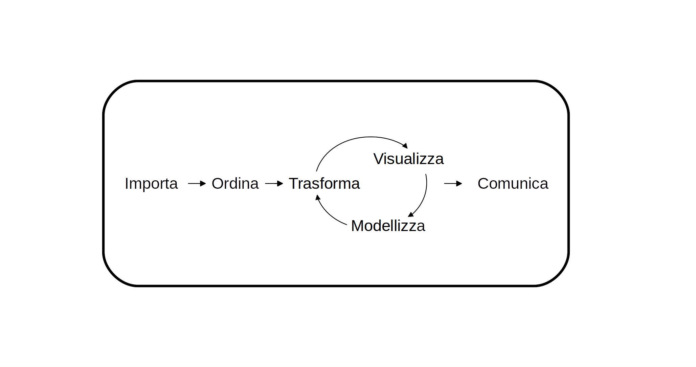
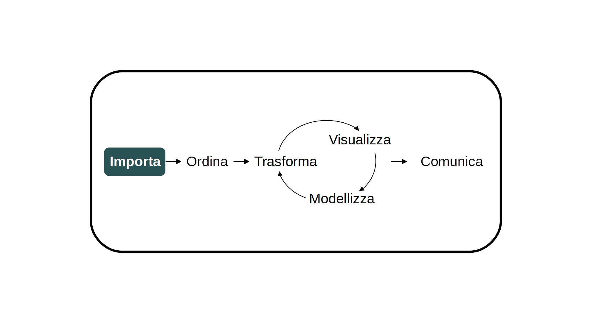
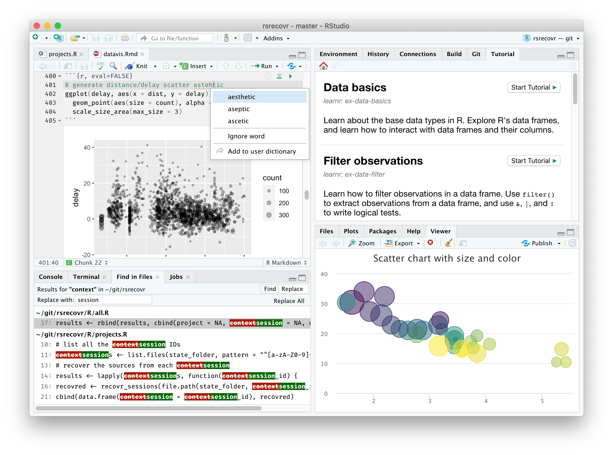
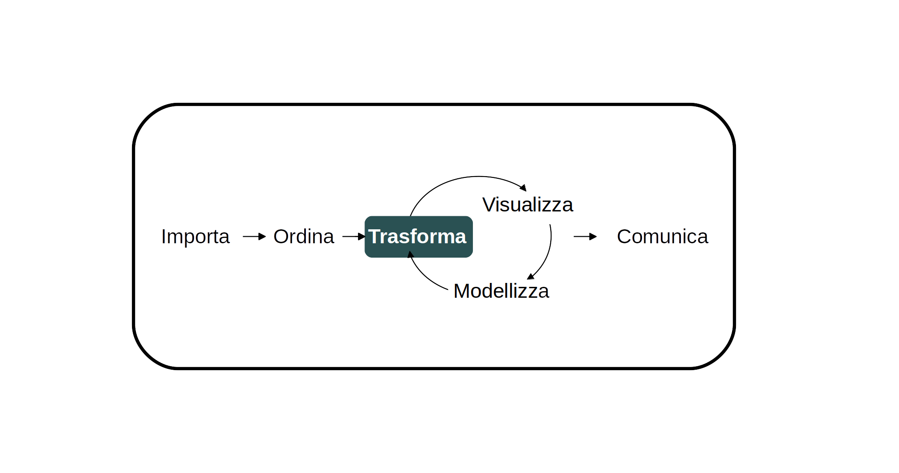
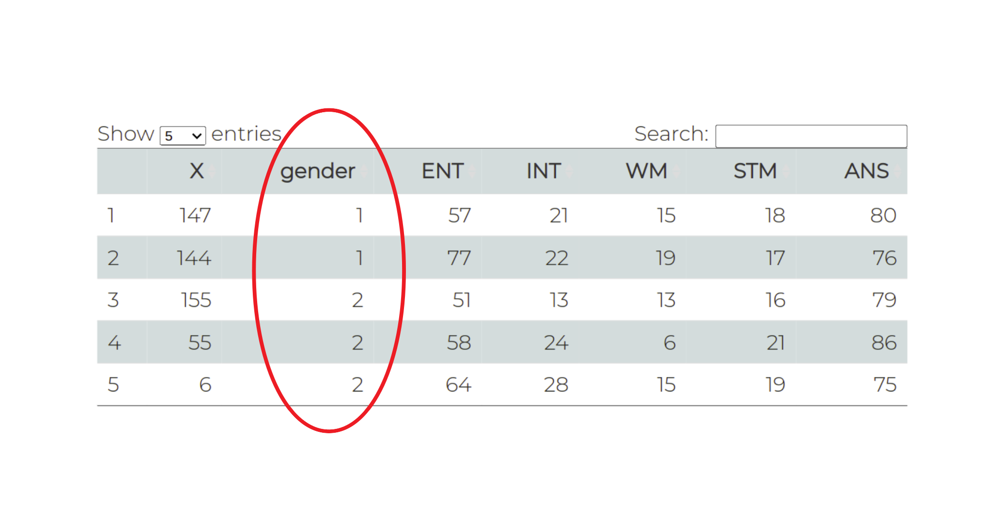
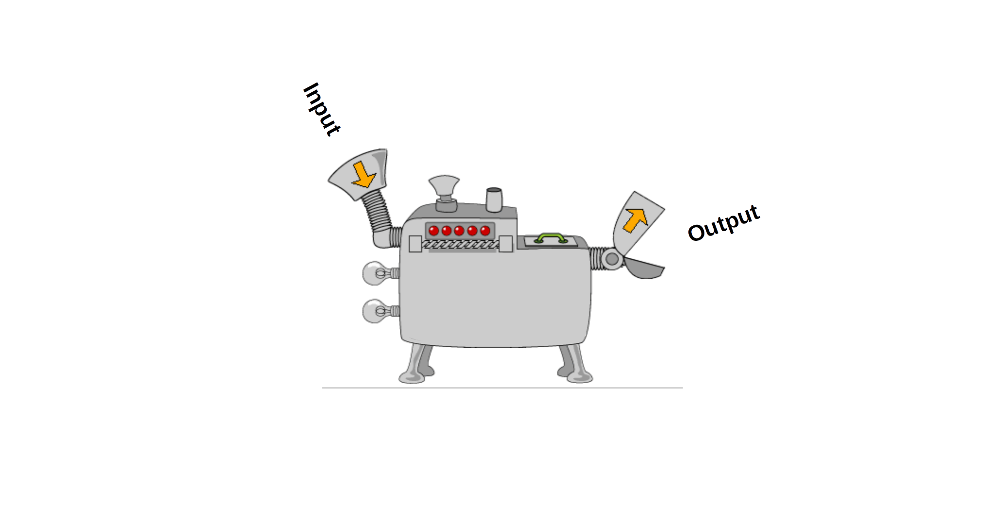
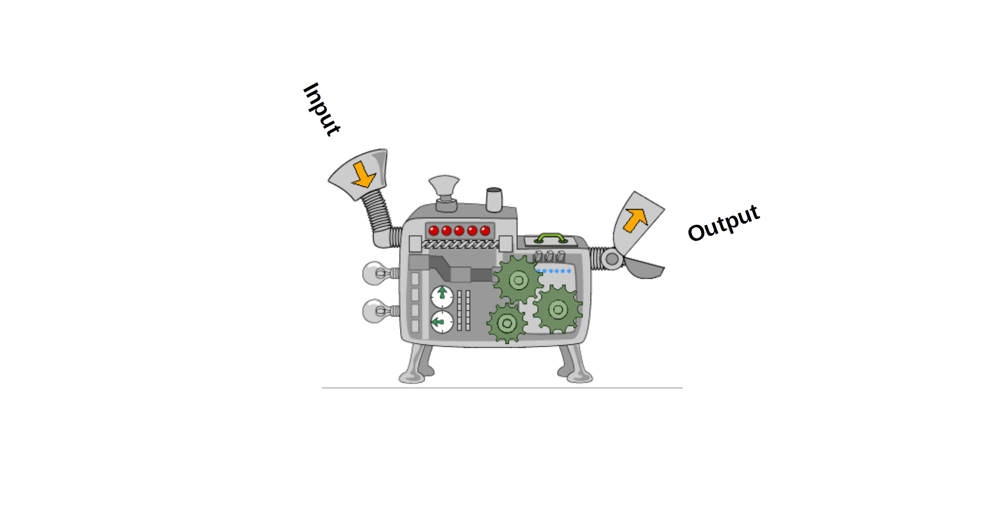
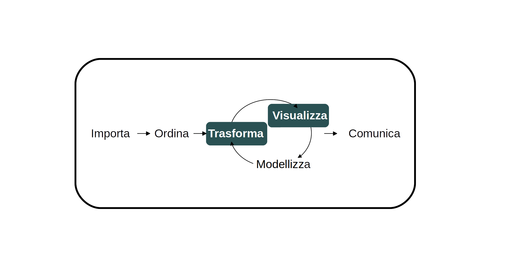

```{r xaringan-themer, include=FALSE, warning=FALSE}
options(htmltools.dir.version = FALSE)
#library(xaringanthemer)
# style_mono_accent(
#   base_color = "#1c5253",
#   header_font_google = google_font("Josefin Sans"),
#   text_font_google   = google_font("Montserrat", "300", "300i"),
#   code_font_google   = google_font("Fira Mono")
# )
```

class: inverse, middle, center

# Introduzione

---

### Chi sono?

--

- Magistrale in Psicologia Cognitiva Applicata.

--

- Ph.D in Psychological Science. 

--

- Decision Making, Eye-tracking e Computational modeling. 

---

### Alcune informazioni su di voi

<iframe src="https://embed.polleverywhere.com/multiple_choice_polls/RFKPzMNVxzPho3is7S7go?controls=none&short_poll=true" width="800px" height="450px"></iframe>

https://pollev.com/simonedambro354

---

### Alcune informazioni su di voi

<iframe src="https://embed.polleverywhere.com/multiple_choice_polls/T555mjWonqQ3x2Z01cKxV?controls=none&short_poll=true" width="800px" height="450px"></iframe>

https://pollev.com/simonedambro354

---
### Obiettivi di questo corso:

--

- Imparare a programmare in R.

--

- Acquisire gli strumenti necessari ad analizzare i dati della tesi magistrale.

--

- Imparare a Manipolare, Visualizzare e Modellizzare i dati.

---

### Perchè R?

--

- È potente.

--

- È in continuo aggiornamento e miglioramento.

--

- Per qualsiasi problema, c'è una community gigantesca in tutto il mondo.

--

- È gratis.

--

<br><p> Qualche esempio ... </p>

--

- Si possono creare delle presentazioni.

--

- Si possono produrre dei <b><a href="Slide_files/Power-Analysis.html" target="_blank">Report</a></b> di alto livello con poco sforzo.

--

- Si possono creare delle <b><a href="https://simone-dambrogio.shinyapps.io/shiny_app/" target="_blank">App interattive</a></b>.


---

class: inverse, middle, center

# Analisi dei dati con R

---

###Work Flow



.footnote[
[1] Wickham, H., & Grolemund, G. (2016). R for data science: import, tidy, transform, visualize, and model data.
]

---

### Work Flow


.footnote[
[1] Wickham, H., & Grolemund, G. (2016). R for data science: import, tidy, transform, visualize, and model data.
]

---
### RStudio



---

### Creare un Project

<video style="position: absolute; left: 50%; transform:translateX(-50%);" width="650" controls>
  <source src="Slide_files/figure-html/New Project.mp4" type="video/mp4">
</video>

---

### Importare un dataset

Se il dataset è un .csv
```{r eval=F}
read.csv("percorso_ai_dati.csv")
```
<br>
Se il dataset è un .txt
```{r eval=F}
read.table("percorso_ai_dati.txt", header=TRUE)
```
<br>
Se il dataset è un .rda
```{r eval=F}
load("percorso_ai_dati.rda")
```
<br>
Per tutto il resto c'è... Google!

Se il dataset è stato salvato usando SPSS <b><a href="https://www.r-bloggers.com/2014/03/how-to-open-an-spss-file-into-r/" target="_blank">(.sav)</a></b>

Se il dataset è un <b><a href="http://www.sthda.com/english/wiki/reading-data-from-excel-files-xls-xlsx-into-r" target="_blank">.xls/xlsx</a></b>

---

### Dataframe

```{r eval=FALSE}
read.csv("R/Data/earlymath.csv")
```
<br>
```{r  eval=require('DT'), echo=FALSE }
DT::datatable(
  read.csv("R/Data/earlymath.csv"),
  fillContainer = FALSE, options = list(pageLength = 5)
)
```

---



---
### Vettori

Un vettore è un caso particolare di matrice. 

Un dataframe può essere pensato come è una matrice che ha delle caratteristiche particolari. 

Quindi, per manipolare un dataframe è necessario sapere come manipolare un vettore.

--



---
### Vettori

Creare un vettore numerico di nome "*primo_vettore*" che contenga 1, 2, 3, 4, e 5

--

```{r}
primo_vettore <- c(1, 2, 3, 4, 5)
primo_vettore
```

--

Usiamo la nostra prima funzione: "***seq()***" per creare un nuovo vettore uguale al precedente
--
```{r}
primo_vettore_seq = seq(from=1, to=5, by=1)
primo_vettore_seq
```
--
Un altro modo ancora per creare lo stesso vettore è l'uso dei due punti
```{r}
ultimo_vettore = 1:5
ultimo_vettore
```

---

### Vettori

Nella slide precedente abbiamo usato la *funzione* seq().



---

### Vettori

Nella slide precedente abbiamo usato la *funzione* seq().



---

### Vettori

Alcune funzioni utili a creare e manipolare vettori

--

***rep()***
```{r}
a = rep(2, 5)
a
```

--

***length()***
```{r}
length(a)
```

--

***rnorm()***
```{r}
rnorm(length(a), 100, 15)
```


---
### Vettori

Alcune funzioni utili a creare e manipolare vettori

--

***sample()***
```{r}
sample_vector = sample(1:5, 10, replace = TRUE)
sample_vector
```

--

***sum()***
```{r}
sum(sample_vector)
```

--

***mean()***
```{r}
mean(sample_vector)
```

--

***?sd()***

---
### Vettori

Accedi agli elementi di un vettore

--

```{r}
sample_vector[3]
```

--

```{r}
sample_vector[length(sample_vector)]
```

--

```{r}
sample_vector == 1
```

--

```{r}
sample_vector[sample_vector == 1]
```

--

```{r}
sample_vector[sample_vector != 1]
```

---

### Vettori

Il simbolo del dollaro permette di selezionare una colonna e di trasformarla in un vettore
```{r}
dtf <- read.csv("R/Data/earlymath.csv")
dtf$gender
```

---

### I messaggi da portare a casa da questa lezione:

--

- Use R!

--

- È normale che all'inizio sia difficile, un pò noioso e che si facciano continuamente errori!
Con un po di pratica diventerà tutto più facile e divertente.

---
### La prossima volta



---

### La prossima volta
- Impareremo nuove funzioni

--

- Introdurremo matrici e liste

--

- Inizieremo a capire come fare grafici di alto livello con *ggplot2*

---


